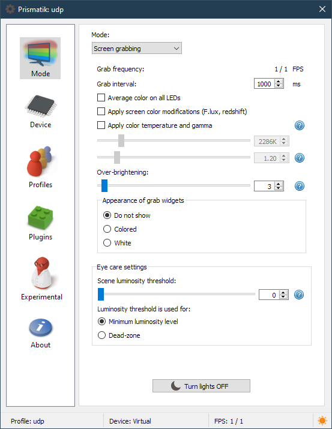
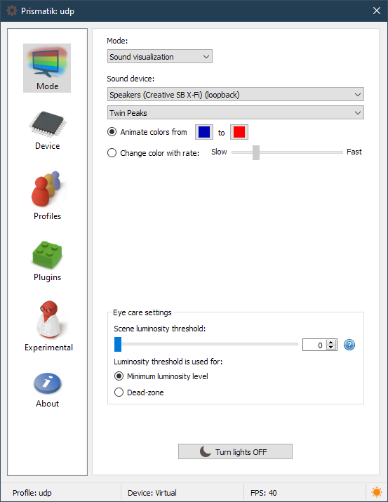
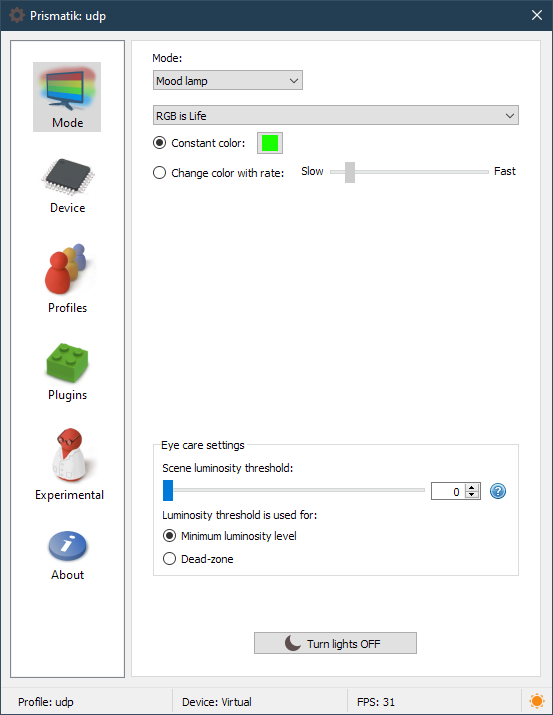
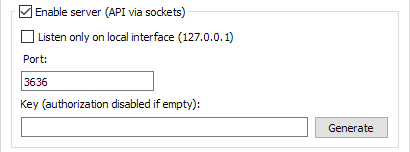

	

Lightpack project with Prismatik flavour
---------
[![Latest version](https://img.shields.io/github/v/release/psieg/Lightpack?logo=data:image/png;base64,iVBORw0KGgoAAAANSUhEUgAAACAAAAAgCAYAAABzenr0AAAAGXRFWHRTb2Z0d2FyZQBBZG9iZSBJbWFnZVJlYWR5ccllPAAACAxJREFUeNq8V2lsVOcVPW+Z5c2Cdxvvy9ge29gOi4CAgSAqSAuVGtqUKGCQmkVNaCqlUUiaElVA0ihRq0KLIBDKElyUEGISwEAc7GLAIsQxGNvEMXjDY2yP17FnPNt7b97rnTGkULlLEpxP+n7Y773vnHvvued+A1VVMVnb7/HghRc3vrRuw5N/9Xt9E77DYpJWb0+P8Re/2rznqP/sWw1pHY85BhyGid6bFAKXai5nr3ruz5Wfm+uein0qFlI4wvoc/VO/BwIKSo6cWPH0H46dH85snxtVrAUkFqJW1nX0d6ZM9AV/v6B9YyPYvPODV0prnK8LOddZ4ZFgzfWArAJGFjcdXZn0WtWkELB1tIZt2Hn87fqBiMdN6ZfBLnNQMoz0hMAZAjFoYOvryZ6UDFRXX8j/3aHagyNc+gxDxGFg8QCBGqFKChgNGyoyryMCnu4sSPSB5r5pIIB33n3v0fUlX57zmPNncHgfalEfGFYARIo82Ga3w+N5HoPsSLrH5Wbuiwg9zmG8+MauzVtrccQYkxspu/ZCfbAXDCdAFZVQ6gNEQPrcSTxVcCyHEX4soX+oP/w7E2hvuR61dvP+o6edlt9HRSbD278b6qxbYHghlPZg2SWKXDjmRNYeLwIjEliGgU+Qouwj/QnfiUBF5T9mrt16+lx72LyVkXoTxrp3IVDYQbUORq6GwANUY13ZKOaVc7BKBvBtIlRCCRjBdg7Z0r4dAUXCjn2H1jz/QctZOW3RNBOl12V7B3LODQI3hMCDxfUpIviTDiw+wyPOoEMYxyKiWYIcIEFSK7YNd2Z94y4Ycwyyr+44/MYnA9EvR1vngRkbg6vzb5AymsBqTZRvOlzHwSv5ENlq+mz6RSUuWa/LkDgFeoovsV1F76gMXtCgV+zP+kYZaP6yYeqaLe8er3BnvhybagVDw8XVsQ9iwlUCJWuXgpEzcPs9mNLE1773xO4fWeYWVgRED/R0spaMMHWIBdtNmRG06KRWVLyB/4/AqdPl89b9pfJ8V8SDKyKjY6B6Rbha98Mf/QWBG0PgUAmcwIxfMVf2Fm/7cWpa8mj8zPwLouyFgaOWpywkBViEtZABUDmGOWeqy+ni/zuBgIhte0qe2HDcdoa1LMwyEvNga7laDsA35WIIXJXHBechcFMLV1fy9K4VBTMK+4Kf586dU+3Xsj4qOXS0o7QcklplkDzg1Hji7cN9Mf+RwHBfj+bZLW9v3d0k7I2wzDJqyGxUSYbr2m54tOXUWzqoCtU8CO73wtypqS95hsCnF9jvnJGVl9fJJ8Y1agNSqAyCjoG1lx4MyvDpJbNtoCtpQgLX6uuSVr926FS1nPd8dGI6DRF/MEiolBHemApBXATOTj7ikOF3jyLBYTr/8UsHFxY8UNB794EmrVaNLJxWpYg+CFzQBYFsLwehQ4QyhUG3szf937pAxcnK6gWbShtLlMRFaeFahlIsjj9VKVpeAyFjGfSSBJWAA+5ujPQ0Ij7MYLvS1DpflMV6S1qqndP9675hKZpfYS//dEMMZ6LTFaRQ/RNuiBiwcmjvsd3TCfzZigrr+ld3VEUVreG0rEzj20B60YJVZIpeJg+g+il+0gapV8eD16YiOiwVHR5X8cbSG8V6qcaRZFbrClIjz82fnl1VmJtZnzWj8Jwt3NxrgBIfYBmY9BzyukRclXl0++xZodTengq8JdtqX780/zdXq7YXj45Kc5T4bHhTCjAWnUFzPJpSqAXHsGAUX4iEEiRFW8up0EVPJXKxET1+/5L2ZueSj65cghGV3fExwsXcAKQFOsBPQKRDTB9lUDoEdAf6LbJbAm8aH4tM8GIYXE6Xk/nizJkFdUePrhtpaPiJKiNmLDYFtqg09IalwBeWAEaIAM9SFkhgTLBMtFVlnBAxC01AhVxvTJSRab+EP8IGLhQAGZpbxvqlKsaihM5Plh/IjU2K895D4M4K/tXc3BzXUHZi5XBlxVrzLdt8IznKoCkcTboItBri0G9OgtcYSy1pgoaywyvjhELaISIq+YM63I5t7hpYBCE0GQ3kG79NkVA+m/Edm7M9t7Cw8GYQj9u0adM9BIKliYmOdufPL6rNWPnTfc7M7E/tftFnsncnL3IPmB9RhrDA3YGMwSaYhtsgufrgIsWP0cSRGQ19T85HwnMrDHLcNswSmNChpqAReWScTvbzD5lnfGRNz+6ckMDdy0CRW7Kzb81cvvwUv3Dxga8E4/Ubff3h5hFH6gKNwqwQAliqDKLI04EcZxvMzi6InmE4RRGjrB5aTz+W6/zkJqQhEqPGo+BojA95kdbzc6yzrk5Ygv+1Rvwi6i9Wz2o7cax4SsPln02TPMmWKWZodVpIpIURWUYnpbs+oEMXte6zYTwZ0rjdKD4Fj2aMIG/u8je3r3v9lW9F4O7V0tUVXn/q5Ap31Zm1qd03l1i1vCbKbKKbERfSgky596pfdxxMpNON+lE0FeV/WPbr/T8P2uB3InBnOSnqazU1+S0nPl5tqKtZleNxWlLNRmh0egQtTbmNYaSbUZnfjTcLwy+f21g6WzAJ6n0hcPfqsNuN1yorHh4qL1uX1Nm2LIeHEGUyI8BzoRaz+yWsjvD0HX6r1JqemDx63wl8fXGl3Vhbm9V6umwV+9mFx60uxzSLSYCZLPsxtz3w3J/25T/0wOxmTOav4zu7a2hIe+rDIz88+Msn/37hB/OGXshJVHe9X/JwKPjvg8Cd7aN9taEhbedrW55pvNYYH/zfPwUYAH+ameVO5VWrAAAAAElFTkSuQmCC&labelColor=lightGrey&color=96ca00)](https://github.com/psieg/Lightpack/releases)

*Modified version which includes various improvements for Windows, esp. a Desktop Duplication API Grabber*

**Table of Contents:**  
&nbsp;&nbsp;[Short Description](#lightpack-project-with-prismatik-flavour)  
&nbsp;&nbsp;[Main Features](#main-features)  
&nbsp;&nbsp;[Supported Devices and Protocols](#supported-devices-and-protocols)  
&nbsp;&nbsp;[Making Plugins](#making-plugins)  
&nbsp;&nbsp;[Useful URLs](#useful-urls)  
&nbsp;&nbsp;[Build Prismatik with Windows](#prismatik-build-instructions-for-windows)  
&nbsp;&nbsp;[Build with Linux](#build-instructions-for-linux)  
&nbsp;&nbsp;[Build with OS X](#build-instructions-for-os-x)  
&nbsp;&nbsp;[Build Firmware](#firmware-build-instructions)  

**Lightpack** is a fully open-source and simple hardware implementation of the backlight for any computer. It's a USB content-driven ambient lighting system.

**Prismatik** is an open-source software we buid to control Lightpack devices. It grabs the screen, analyzes the picture,
calculates resulting colors, and provides soft and gentle lighting with a Lightpack device. Moreover, you can
handle other devices with Prismatik such as Adalight, Ardulight, or even Alienware LightFX system.

##### Main Features:
* Fully open-source under GPLv3 (hardware, software, firmware)
* Cross-platform GUI (Qt)
* USB HID (no need to install any drivers)
* The device is simple to build (just Do-It-Yourself)
* Ambilight

  

* Sound Visualizers

  

* Mood Lamps

  

* Profiles
* Network accessible API ([documentation](https://github.com/Atarity/Lightpack-docs/blob/master/EN/Prismatik_API.md))

  

  * [code samples](Software/apiexamples)
  * [Home Assistant integration](https://github.com/zomfg/home-assistant-prismatik)
  * [AutoHotKeys example](https://github.com/psieg/Lightpack/issues/306#issuecomment-586597755)

##### Supported Devices and Protocols:
* Lightpack PC/v1
* Serial
  * Adalight
  * Ardulight
  * Arduino
  * ESP8266/ESP32 ([WLED](https://github.com/Aircoookie/WLED) firmware highly recommended)
* Wi-Fi UDP:
  * WARLS
  * DRGB
  * DNRGB
  * ESP8266/ESP32 ([WLED](https://github.com/Aircoookie/WLED) firmware highly recommended)

##### Making Plugins:
* [template](Software/res/plugin-template.ini)
* [code samples](Software/apiexamples)

##### Useful URLs:
* [Project mothership](https://github.com/psieg/Lightpack/)
* [Original project mothership](https://github.com/woodenshark/Lightpack/)
* [Binary downloads](https://github.com/psieg/Lightpack/releases)
* Wiki with DIY and documentation [ENG](http://code.google.com/p/light-pack/w/list) / [RUS](http://code.google.com/p/lightpack/w/list)
* [Post new issue](https://github.com/psieg/Lightpack/issues)
* [Team](https://github.com/psieg/Lightpack/graphs/contributors)

---

### Prismatik Build Instructions for Windows
#### Prerequisites:
* [Qt SDK](http://qt-project.org/downloads), you may need to set `%QTDIR%` (sysdm.cpl &rarr; Advanced &rarr; Environment Variables &rarr; New) to something like `C:\Qt\x.xx.x\msvc_xxxx\`.
* Visual Studio, [Windows SDK](https://msdn.microsoft.com/en-us/windows/desktop/ff851942.aspx) or [Microsoft DirectX SDK](http://www.microsoft.com/en-us/download/details.aspx?id=6812)
* optional (if you want to create an installer) POSIX shell utilities [MSYS for example](http://www.mingw.org/wiki/MSYS).
* optional [any](https://wiki.openssl.org/index.php/Binaries) [OpenSSL binaries](https://slproweb.com/products/Win32OpenSSL.html) to include them in the setup. If you just want to build, you can skip them in `build-vars.prf` (this will render the update check ineffective).
* optional [BASS and BASSWASAPI](http://www.un4seen.com/) for the Sound Visualizer. You can skip them in `build-vars.prf`.

#### Build Process:
1. Go to `<repo>/Software`
2. Copy and edit `build-vars.prf` according to your machine
3. Optional: if locales changed: run `update_locales.bat` or `./update_locales.sh` (slow on Windows)
4. Run `scripts/win32/generate_sln.bat` (from the Visual Studio Developer prompt / `vcvarsall.bat`)
5. Build `Lightpack.sln` with MSBuild / VisualStudio

#### Building an Installer:
1. Run `scripts/win32/prepare_installer.sh`. (This builds the autoupdater (UpdateElevate), needs the submodule checked out and currently works only with VS2015).
2. Build `dist_windows/script.iss` (64bit) or `script32.iss` (32bit) with ISCC (the InnoSetup compiler)

---

### Build Instructions for Linux
#### Prerequisites:
You will need the following packages, usually all of them are in distro's repository:
* qt5-default
* libqt5serialport5-dev
* build-essential
* libgtk2.0-dev
* libusb-1.0-0-dev
* libnotify-dev
* libudev-dev
* qttools5-dev-tools
* if you are using Ubuntu: libappindicator-dev
* not required, but the update checker uses SSL sockets: openssl
* for sound visualizer: `libpulse-dev`, `libfftw3-dev`

#### Build Process:
1. Go to `<repo>/Software`
2. Optional: if locales changed: run `./update_locales.sh`
3. Run `qmake -r`
4. Run `make`

#### Building a deb Package:
1. Run `scripts/linux/prepare_installer.sh`
2. `cd dist_linux` and run `build-deb.sh`

#### Manual Deployment:
Instead of building a deb package, you can:

1. Add a rule for **UDEV**. See comments from `<repo>/Software/dist_linux/deb/etc/udev/rules.d/93-lightpack.rules` for how to do it.
2. Make sure `<repo>/Software/qtserialport/libQt5SerialPort.so.5` is available for loading by *Prismatik* (place it in appropriate dir or use *LD_LIBRARY_PATH* variable)

---

### Build Instructions for OS X
#### Prerequisites:
* Qt SDK (5.0+)
* MacOSX 10.9.sdk

###### Whole Dependencies List for Prismatik 5.10.1:
* QtCore.framework
* QtGui.framework
* QtNetwork.framework
* QtOpenGL.framework

#### Build Process:
1. Download and unpack 5.0+ **Qt SDK** from www.qt-project.org
2. Go to `<repo>/Software`
3. Optional: if locales changed: run `./update_locales.sh`
4. CLI
   1. Run `qmake -r`
   2. Run `make`
5. or Xcode
   1. Run `./scripts/macos/generate_xcode_project.sh`
   2. Open `Lightpack.xcodeproj`

#### Building a dmg package:
1. Run `macdeployqt bin/Prismatik.app -dmg`

---

### Firmware Build Instructions

**Updating Firmware on Windows:**
If you don't want to build the firmware yourself, you can follow the [documentation](https://github.com/Atarity/Lightpack-docs/blob/master/EN/Lightpack_firmware_update_with_FLIP_utility.md) for flashing the latest firmware on Windows.

*Please note that these instructions are for Debian based systems.*

**Compiling Firmware Only:**

1. Install [AVR GCC Toolchain](http://avr-eclipse.sourceforge.net/wiki/index.php/The_AVR_GCC_Toolchain): `sudo apt-get install gcc-avr binutils-avr avr-libc`
2. Compile the firmware:
  * `cd Firmware`
  * `make LIGHTPACK_HW=7` (or any other hardware version 4-7)
  * Alternatively, you can do `./build_batch.sh` to build the firmware for all hardware versions
3. The firmware can be found in the same directory (individual build) or *Firmware/hex* (batch build).

**Compiling and Uploading Firmware to Device:**

1. Install [AVR GCC Toolchain](http://avr-eclipse.sourceforge.net/wiki/index.php/The_AVR_GCC_Toolchain) and **dfu-programmer**: `sudo apt-get install gcc-avr binutils-avr avr-libc avrdude dfu-programmer`
2. Reboot device to bootloader (via the secret button on the device)
3. Compile and upload the firmware:
  * `cd Firmware`
  * `make LIGHTPACK_HW=7 && make dfu LIGHTPACK_HW=7` (or any other hardware version 4-7)

---

Please let us know if you find mistakes, bugs or errors. Contributions are welcome. 
Post new issue : https://github.com/psieg/Lightpack/issues
